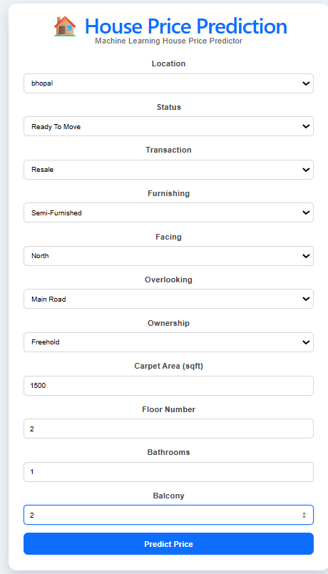
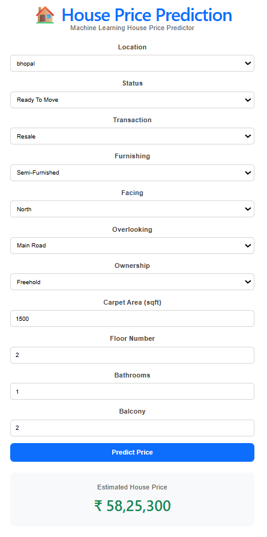

# 🏠 House Price Prediction System

## 📌 Project Overview

This project is an end-to-end Machine Learning web application developed as part of the **ITI Machine Learning Training Program**.

The application predicts house prices based on several property features such as location, status, transaction type, furnishing, ownership, facing direction, carpet area, floor number, bathrooms, balconies, and overlooking.

The project demonstrates the complete Machine Learning workflow, including:

- Data preprocessing
- Exploratory Data Analysis (EDA)
- Feature Engineering
- Model Training & Evaluation
- FastAPI Backend
- React Frontend
- REST API Integration

---

# 🏗️ System Architecture

```text
                 +----------------------+
                 |   React Frontend     |
                 |     (Vite + React)   |
                 +----------+-----------+
                            |
                      HTTP Requests
                            |
                            ▼
                 +----------------------+
                 |    FastAPI Backend   |
                 |      REST API        |
                 +----------+-----------+
                            |
                      Prediction Logic
                            |
                            ▼
                 +----------------------+
                 | Random Forest Model  |
                 | house_price_model.pkl|
                 +----------+-----------+
                            |
                      Predicted Price
                            |
                            ▼
                 +----------------------+
                 |   React Frontend     |
                 | Displays Prediction  |
                 +----------------------+
```

---

# ✨ Features

- Predict house prices using a trained Machine Learning model
- Random Forest Regressor model
- FastAPI REST API
- React + Vite frontend
- Dynamic location dropdown
- Real-time predictions
- Responsive and user-friendly interface

---

# 📊 Dataset

This project uses the **House Price** dataset by **Juhi Bhojani** from Kaggle.

## Dataset Link

https://www.kaggle.com/datasets/juhibhojani/house-price

## Download Instructions

1. Download the dataset from Kaggle.
2. Extract the ZIP file.
3. Place the CSV file inside:

```text
notebooks/data/
```

4. Run:

```text
notebooks/house_price_model.ipynb
```

The notebook performs:

- Data Cleaning
- Exploratory Data Analysis (EDA)
- Feature Engineering
- Model Training
- Model Evaluation
- Model Export

---

# 🛠️ Technologies Used

## Machine Learning

- Python
- Pandas
- NumPy
- Scikit-learn
- Joblib

## Backend

- FastAPI
- Pydantic
- Uvicorn

## Frontend

- React
- Vite
- JavaScript
- CSS

## Version Control

- Git
- GitHub

---

# 📂 Project Structure

```text
house-price-project/

├── backend/
│   ├── app.py
│   ├── predictor.py
│   ├── schemas.py
│   └── requirements.txt
│
├── frontend/
│   ├── public/
│   ├── src/
│   ├── package.json
│   ├── package-lock.json
│   └── vite.config.js
│
├── models/
│   ├── house_price_model.pkl
│   ├── feature_columns.pkl
│   └── locations.json
│
├── notebooks/
│   ├── data/
│   └── house_price_model.ipynb
│
├── screenshots/
│   ├── before_prediction.png
│   └── after_prediction.png
│
├── .gitignore
└── README.md
```

---

# 🚀 Setup Instructions

## 1. Clone the Repository

```bash
git clone https://github.com/saraallam714-code/house-price-project.git

cd house-price-project
```

---

## 2. Create a Virtual Environment

```bash
python -m venv .venv
```

Activate it.

### Windows

```bash
.venv\Scripts\activate
```

### macOS / Linux

```bash
source .venv/bin/activate
```

---

## 3. Backend Setup

```bash
cd backend

pip install -r requirements.txt

uvicorn app:app --reload
```

Backend runs on:

```
http://127.0.0.1:8000
```

---

## 4. Frontend Setup

```bash
cd frontend

npm install
```

Create a file named:

```text
.env
```

Add the following line:

```text
VITE_API_URL=http://127.0.0.1:8000
```

Then start the frontend:

```bash
npm run dev
```

Frontend runs on:

```
http://localhost:5173
```

---

# 🔐 Environment Variables

| Variable | Description | Example |
|----------|-------------|---------|
| VITE_API_URL | Backend API URL | http://127.0.0.1:8000 |

> **Note:** The `.env` file is intentionally ignored by Git for security and configuration purposes. Create it manually before running the frontend.

---

# 🔗 API Reference

## GET /locations

Returns all available locations.

### Example Response

```json
{
  "locations": [
    "bhopal",
    "mumbai",
    "indore"
  ]
}
```

---

## POST /predict

### Request

```json
{
  "location":"bhopal",
  "status":"Ready To Move",
  "transaction":"Resale",
  "furnishing":"Semi-Furnished",
  "facing":"North",
  "overlooking":"Main Road",
  "ownership":"Freehold",
  "carpet_area_sqft":1500,
  "floor_num":2,
  "bathroom":1,
  "balcony":2
}
```

### Response

```json
{
  "predicted_price":5825300
}
```

---

## cURL Example

```bash
curl -X POST http://127.0.0.1:8000/predict \
-H "Content-Type: application/json" \
-d "{\"location\":\"bhopal\",\"status\":\"Ready To Move\",\"transaction\":\"Resale\",\"furnishing\":\"Semi-Furnished\",\"facing\":\"North\",\"overlooking\":\"Main Road\",\"ownership\":\"Freehold\",\"carpet_area_sqft\":1500,\"floor_num\":2,\"bathroom\":1,\"balcony\":2}"
```

---

# 📈 Machine Learning Model

**Selected Model**

- Random Forest Regressor

### Data Preprocessing

- Missing value handling
- Exploratory Data Analysis (EDA)
- Feature Engineering
- Floor extraction
- Area conversion
- One-Hot Encoding
- Numerical feature preparation

---

# 📊 Model Performance

| Model | MAE | RMSE | R² |
|------|-------------:|-------------:|------:|
| Linear Regression | 5.73e+06 | 7.58e+07 | 0.0171 |
| **Random Forest (Selected Model)** | **1.92e+06** | **7.63e+07** | **0.0024** |

The Random Forest Regressor was selected as the final model because it achieved the lowest Mean Absolute Error (MAE), making it the most suitable model for this application.

---

# 📷 Application Screenshots

## Before Prediction



---

## After Prediction



---

# ✅ Conclusion

This project demonstrates a complete Machine Learning deployment pipeline, starting from data preprocessing and model training to building a REST API with FastAPI and integrating it with a React frontend. It showcases how a trained Machine Learning model can be deployed as a user-friendly web application for real-time house price prediction.

---

# 👨‍💻 Developed By

**Sara Ahmed Farouk Allam**

